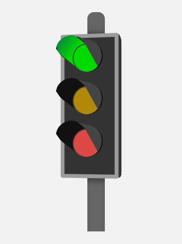
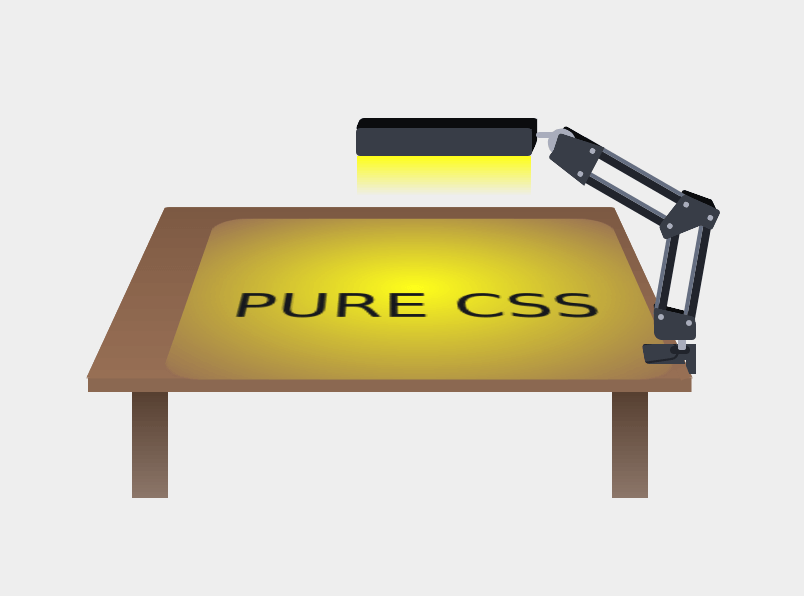

# Pure Css Art :art:

A collection of CSS art created by me for fun and practice.

## Repo Purpose

To create fun art using only CSS to transform and decorate HTML elements.
This will serve as practice and way to test CSS features which are not always
used.

## Gallery

``

## Author

- Website - [Carlos E Alford M](https://carlosealford.com)
- Twitter - [@webshuriken](https://www.twitter.com/webshuriken)

## Acknowledgements

Thanks to [Indian Type Foundry](https://www.indiantypefoundry.com/) for creating
the font used in this site.
